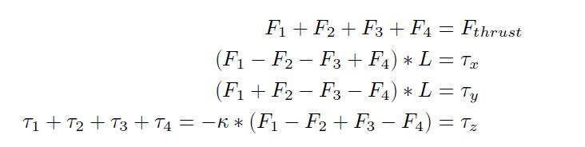
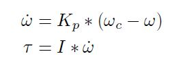
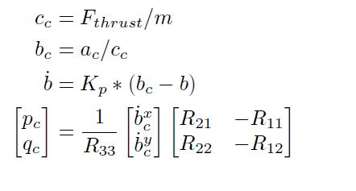
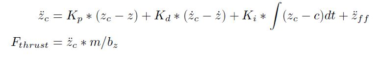
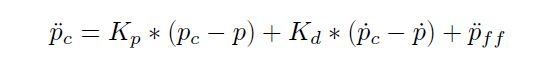
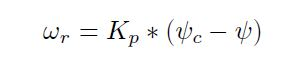

## Project: 3D Motion Planning by

### Implemented Controller
---
#### 1. `Generate Motor Commands`
Please refer to function QuadControl::GenerateMotorCommands in L56 – L91 in QuadControl.cpp. Math behind the scene is:

Where F1...4 is the thrust generated by motor 1 to 4 and Tau1...4 is the reactive moment. K is the drag-thrust ratio. tau_x, tau_y and tau_z is the collective moment around x/y/z axis in body frame. All variables above are scalars. Also notice motors are labeled in the order of front-left, front-right, rear-right, rear-left as 1 to 4.

#### 2. `Body Rate Control`
Please refer to function QuadControl::BodyRateControl in L94 – L127 in QuadControl.cpp. Math behind the scene is:

Where omega_dot is the angular acceleration round x-axis, y-axis and z-axis in body
frame. omega_c is the commanded angular velocity in body frame, while omega is the
actual angular velocity in body frame. Kp is the control gain parameter. I is
the moment of inertia, and finally tau is the resulting moment. All variables are
vectors unless explicitly stated otherwise.

#### 3. `Roll Pitch Control`
Please refer to function QuadControl::RollPitchControl in L131 – L175 in QuadControl.cpp. Math behind the scene is:

Where Fthrust is the total thrust and m is the mass of the drone (scalar). a_c is the commanded acceleration. Kp is the control gain parameter. R is the rotation matrix w.r.t. the current attitude of the drone, and b is the last column vector of R (that is, bx = R13, by = R23, bz = R33). pc and qc are the commanded body rate around x-axis and y-axis (scalars), which will be fed to body rate control.

#### 4. `Altitude Control`
Please refer to function QuadControl::AltitudeControl in L178 – L216 in QuadControl.cpp. Math behind the scene is:

Where z_dot_dot_c is the commanded acceleration along the z-axis in inertial frame, z_c, z, z_dot_c and z_dot is the commanded/actual altitude and commanded/actual velocity along the z axis in inertial frame. z_dot_dot_ff is the feed-forward acceleration and Kp, Kd, Ki are the control gain parameters. All variables in above equations are scalars.

#### 5. `Lateral Position Control`
Please refer to function QuadControl::LateralPositionControl in L220 – L281 in QuadControl.cpp. Math behind the scene is:

Quite similar with altitude control,x_dot_dot_c is the commanded acceleration along the x-axis and y-axis in inertial frame, p_c, p, p_dot_c and p_dot is the commanded/actual horizonal position and commanded/actual horitonzal velocity in inertial frame. p_dot_dot_ff is the feed-forward acceleration and Kp, Kd are the control gain parameters. Necessary clipping is performed to meet the quad dynamics.

#### 6. `Yaw ontrol`
Please refer to function QuadControl::YawControl in L285 – L311 in QuadControl.cpp. Math behind the scene is:

Where omega_r is the angular velocity around the z-axis in body frame. It is the same as angular velocity of yaw angle (psi_dot) in inertial frame.  psi_c and psi is the commanded yaw angle and actual yaw angle of the drone. Kp is the control gain parameter. All variables above are scalars.
An optimization is done for performing omega_r control. That is, turning in the opposite direction when |omega_r| > pi. Omega_r = psi_dot  holds because with Euler angles in Yaw-Pitch-Roll order, rotation about yaw is applied last. It is not affected by roll and/or pitch rotation so can be considered separately.
